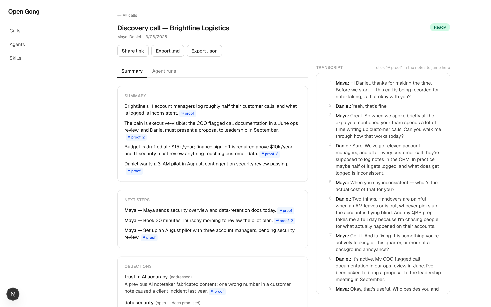
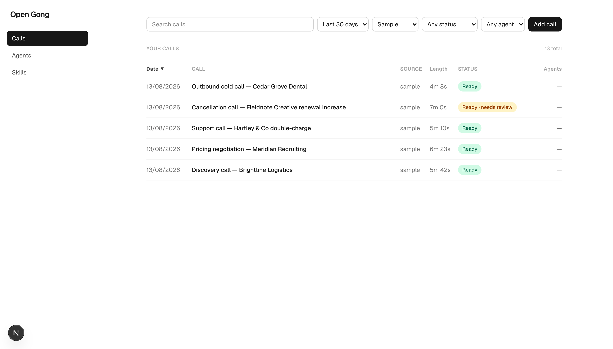
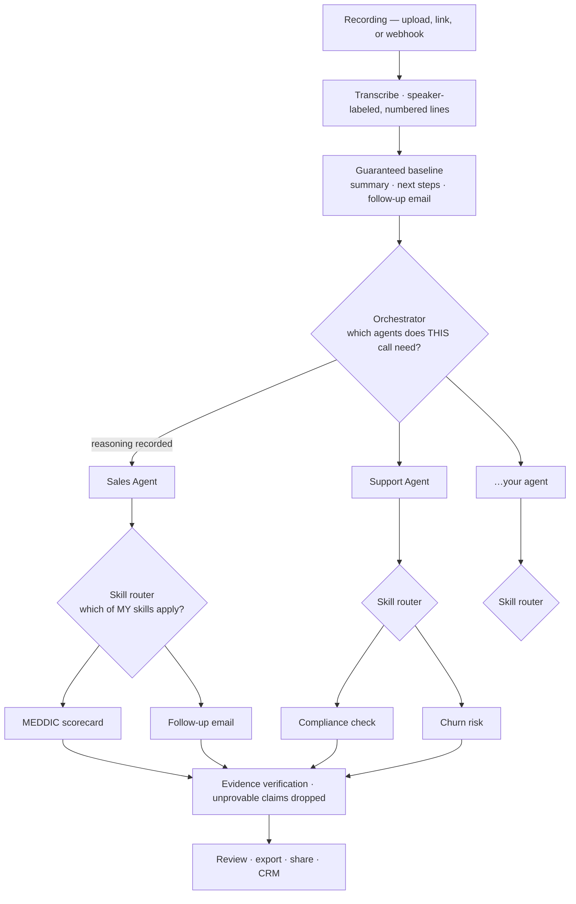

# Open Gong

**An open-source agent framework for conversations. Every claim has a receipt.**

Most call tools summarize. Open Gong *acts* — and shows its work.

Point it at a recording and it decides, per call, which of your agents should
weigh in. Each agent decides which of its skills apply. A sales agent might run
a MEDDIC scorecard and draft the follow-up; a support agent might check
compliance and flag churn risk; a call that needs neither runs neither, and says
why. You write the agents and skills in plain Markdown. The framework routes,
retries, budgets, and refuses to ship a single sentence it can't prove.

That last part is the whole point: **every claim links to the exact line of the
call that proves it.** No proof in the transcript, no claim in the notes.



Click any **❝ proof** chip and the transcript jumps to the line that backs that
claim. A claim with two supporting quotes says so (**proof ·2**). Nothing
reaches the notes without one.



## How it actually works

Three layers, each replaceable, none hardcoded to "summarize a call".



**The orchestrator** makes one decision per call: which agents run. It's steered
by a system prompt *you* can edit, and selecting nothing is a valid, stored
outcome — not a failure. It records its reasoning either way, so an agent that
didn't run is never a mystery.

**Each agent routes its own skills.** One LLM call per dispatched agent, steered
by that agent's own prompt, choosing from only the skills you attached to it.
Its reasoning is stored too — because an agent run with zero steps and no
explanation is indistinguishable from one that silently did nothing.

**The baseline can't be configured away.** Summary, next steps, and a follow-up
email draft run on every call *before* any agent dispatches. Break your agent
config and you still get notes.

**Entry rules** skip the guesswork when you already know: route by inbound phone
line or ingest source straight to a specific agent.

## Author a skill in Markdown

A skill is a file. Drop it in the UI or upload the `.md`:

```markdown
---
name: meddic-scorecard
description: Scores a sales call against MEDDIC
when_to_use: When the call is a sales discovery or qualification call
fields:
  scores:
    - name: economic_buyer
      max: 5
    - name: identified_pain
      max: 5
  claims:
    - decision_criteria
---

Score this call against MEDDIC. For every score, quote the line that
justifies it. If a dimension never came up, say so rather than guessing.
```

The `when_to_use` line is what the router reads. The `fields` block is what
turns prose into structured, verifiable output. That's the entire contract.

Prefer describing the whole thing in a sentence? **Insight packs** compile plain
English — *"score against MEDDIC, flag churn risk, extract deal size"* — into a
JSON schema plus a scoring spec.

## The harness (guardrails, not vibes)

Agents are only useful if they fail honestly. Every step runs inside this:

- **Bad JSON gets caught, never shipped** — schema validation with one repair retry
- **No proof, no claim** — every quote is verified against its cited line; unverifiable claims are dropped and logged, not quietly kept
- **Failed parts retry with the reason attached** — capped at 3 attempts per step
- **Criticality is declared, not assumed** — a failed `summarize` fails the run; a failed optional skill degrades it to `partial`
- **Every run ends in a real state**: `shipped`, `partial`, or `failed` — no zombies
- **Budgets** — per-run cost cap; a breach is a clean stop, not a surprise bill

## Integrations

Connect the CRM your team already lives in from **Integrations** in the sidebar.
Paste an API token and Open Gong verifies it against the provider *before*
storing it — so a connection that appears connected is one that works. Tokens
are never returned by the API, never logged, and shown only as `••••ab12`.

| Provider | Auth | Status |
|---|---|---|
| HubSpot | Private app token | Connect + verify |
| Pipedrive | Personal API token | Connect + verify |
| Salesforce | OAuth | Not yet — shown as a placeholder, no dead buttons |

## Demo in seconds

Five sample calls ship in the repo with precomputed results — **no API keys needed**:

```bash
git clone https://github.com/YOURORG/open-gong && cd open-gong
make demo
# → http://localhost:3000
```

Requires [uv](https://docs.astral.sh/uv/) and Node 20+. That's it.

## Process your own calls

```bash
open-gong init   # mints a PyAI sandbox key (or walks you through pasting one)
```

Then upload a recording or paste a URL. Calls are transcribed via
[PyAI](https://docs.pyai.com) and analyzed with Claude.

<!-- TODO(M7): publish measured cost-per-call here -->

## What ships today

- **Transcript** with speaker names and numbered lines
- **Agents and skills** you create, edit, attach, and route — orchestrator and skill-router reasoning recorded per run
- **Guaranteed baseline** — summary, next steps, follow-up email draft on every call
- **Receipts** — `{quote, line}` evidence on every claim, clickable
- **Scorecards** — built-in sales & support packs, or compile your own from prose
- **Compliance check** — findings stay internal; never in a share link or export
- **CRM connections** — HubSpot and Pipedrive, token verified before storage
- **Exports** — Markdown, JSON, or a revocable share link

## What's next

Honest about the line between built and planned — the framework is pointed at
all of this, and none of it is wired up yet:

| Next | State |
|---|---|
| **Write to the CRM** — log a Note against the matched contact, update deal properties | Designed and spec'd, not built. Matching is deliberately conservative: no confident match means no write, flagged for a human. |
| **Build the deck** — turn a call into slides worth sending | Roadmap |
| **Book the meeting** — take the next step the call agreed on | Roadmap |
| **Human approval gate** — multi-channel (CRM task, Slack, SMS), gating property writes only | Designed; Notes stay direct by design, since they overwrite nothing |
| Web-meeting bots, live in-call coaching, cross-call memory | Roadmap |

The reason these are listed rather than shipped: an agent that writes to your
CRM has to be trusted, and trust is built by the harness above, not asserted in
a README.

## Data retention

Sample audio ships with the repo. Audio you upload stays on your machine
(SQLite + local files by default) and is deletable via a single endpoint. This
is a tool that flags compliance issues — it shouldn't hoard your recordings.

## Status

Early, and moving. Phase 1 — the evidence-cited notes loop — is complete and
verified on real audio. Phase 2 has begun: the agent framework and CRM
connections are in; CRM writes are next. Telephony recordings only for now.

## License

MIT
